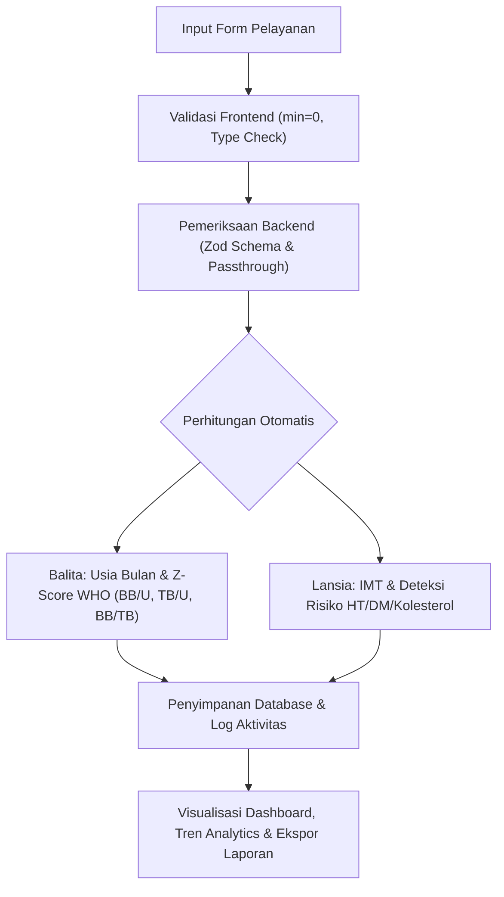

# Laporan Progres Pengembangan Sistem Informasi Posyandu

Dokumen ini berisi rangkuman progres pengembangan aplikasi **Sistem Informasi Posyandu**, mencakup rincian seluruh **Field Input Form**, **Skema Validasi Data**, dan **Rumus Perhitungan Otomatis** (Z-Score WHO, IMT, Deteksi Risiko Kesehatan, serta Analisis Distribusi Kehadiran).

---

## 📌 Ringkasan Status Progres

> [!NOTE]
> Seluruh fitur inti pelayanan Balita & Lansia, validasi input angka positif, perhitungan Z-Score WHO, kalkulasi IMT otomatis, integrasi Action Menu dropdown, serta laporan analytics per wilayah RT/RW telah **selesai dikembangkan dan terintegrasi penuh** pada cabang `dev`.

---

## 👶 1. Modul Pelayanan & Pemeriksaan Balita

### A. Rincian Field Input Form
Formulir pencatatan pemeriksaan fisik dan medis balita mencakup data berikut:

| Nama Field Input | Tipe Data | Aturan Validasi / Constraint | Keterangan & Nilai Default |
| :--- | :--- | :--- | :--- |
| **Tanggal Periksa** | `Date` | Mandatory, $\le \text{Hari Ini}$ | Tanggal pelaksanaan posyandu |
| **Berat Badan (BB)** | `Number` (kg) | Mandatory, Min: `0.1`, Step: `0.1` | Diisi angka desimal positif (contoh: 9.5) |
| **Tinggi/Panjang Badan (TB)** | `Number` (cm) | Mandatory, Min: `0.1`, Step: `0.1` | Diisi angka desimal positif (contoh: 74.2) |
| **Lingkar Kepala (LK)** | `Number` (cm) | Opsional, Min: `0`, Step: `0.1` | Pengukuran lingkar kepala balita |
| **Lingkar Lengan Atas (LiLA)** | `Number` (cm) | Opsional, Min: `0`, Step: `0.1` | Skrining lingkar lengan atas balita |
| **Vitamin A** | `Boolean` | Checkbox (Default: `false`) | Status pemberian kapsul Vitamin A bulan ini |
| **ASI Eksklusif** | `Boolean` | Checkbox (Default: `false`) | Berlaku untuk balita usia 0–6 bulan |
| **Obat Cacing** | `Boolean` | Checkbox (Default: `false`) | Status pemberian obat cacing bulanan |
| **Status Imunisasi** | `Select/String` | Opsional | Pilihan imunisasi (DPT, BCG, Polio, Measles, dll.) |
| **Status KMS** | `Select/String` | Mandatory (Default: `"N"`) | **N** (Naik), **T** (Turun), **O** (Pertama kali/Absen) |

---

### B. Perhitungan & Analisis Otomatis Balita

#### 1. Kalkulasi Usia (Bulan)
Usia balita dihitung secara akurat dalam satuan bulan desimal/integer berdasarkan selisih Tanggal Lahir dan Tanggal Periksa:
$$\text{Usia (Bulan)} = (\text{Tahun}_{\text{periksa}} - \text{Tahun}_{\text{lahir}}) \times 12 + (\text{Bulan}_{\text{periksa}} - \text{Bulan}_{\text{lahir}})$$

#### 2. Klasifikasi Z-Score Standar WHO (2006)
Sistem secara otomatis menghitung indeks antropometri balita berdasarkan standar WHO:

- **Berat Badan menurut Umur (BB/U)**:
  - **Sangat Kurus (Severely Underweight)**: $Z < -3\text{ SD}$
  - **Kurus (Underweight)**: $-3\text{ SD} \le Z < -2\text{ SD}$
  - **Normal**: $-2\text{ SD} \le Z \le +1\text{ SD}$
  - **Risiko BB Lebih**: $Z > +1\text{ SD}$

- **Tinggi/Panjang Badan menurut Umur (TB/U)**:
  - **Sangat Pendek (Severely Stunted)**: $Z < -3\text{ SD}$
  - **Pendek (Stunted)**: $-3\text{ SD} \le Z < -2\text{ SD}$
  - **Normal**: $-2\text{ SD} \le Z \le +3\text{ SD}$
  - **Tinggi**: $Z > +3\text{ SD}$

- **Berat Badan menurut Tinggi Badan (BB/TB)**:
  - **Gizi Buruk (Severely Wasted)**: $Z < -3\text{ SD}$
  - **Gizi Kurang (Wasted)**: $-3\text{ SD} \le Z < -2\text{ SD}$
  - **Gizi Baik (Normal)**: $-2\text{ SD} \le Z \le +2\text{ SD}$
  - **Gizi Lebih (Risk of Overweight)**: $Z > +2\text{ SD}$

---

## 🧓 2. Modul Pelayanan & Pemeriksaan Lansia

### A. Rincian Field Input Form
Formulir pemeriksaan fisik dan medis lansia mencakup data berikut:

| Nama Field Input | Tipe Data | Aturan Validasi / Constraint | Keterangan & Nilai Default |
| :--- | :--- | :--- | :--- |
| **Tanggal Periksa** | `Date` | Mandatory, $\le \text{Hari Ini}$ | Tanggal pelaksanaan pemeriksaan lansia |
| **Berat Badan (BB)** | `Number` (kg) | Mandatory, Min: `0.1`, Step: `0.1` | Diisi angka desimal positif (contoh: 58.5) |
| **Tinggi Badan (TB)** | `Number` (cm) | Mandatory, Min: `0.1`, Step: `0.1` | Diisi angka desimal positif (contoh: 160) |
| **Sistol** | `Number` (mmHg) | Mandatory, Integer, Min: `0` | Tekanan darah sistolik (contoh: 120) |
| **Diastol** | `Number` (mmHg) | Mandatory, Integer, Min: `0` | Tekanan darah diastolik (contoh: 80) |
| **Gula Darah Sewaktu (GDS)** | `Number` (mg/dL) | Mandatory, Min: `0` | Kadar gula darah sewaktu (contoh: 110) |
| **Lingkar Perut (LP)** | `Number` (cm) | Mandatory, Min: `0` | Lingkar perut (contoh: 82) |
| **Kolesterol Total** | `Number` (mg/dL) | Opsional, Min: `0` | Kadar kolesterol total (contoh: 190) |
| **Asam Urat** | `Number` (mg/dL) | Opsional, Min: `0`, Step: `0.1` | Kadar asam urat (contoh: 5.4) |
| **Keluhan Utama** | `Textarea` | Opsional | Catatan keluhan fisik/kesehatan lansia |
| **Tindakan / Rujukan** | `Textarea` | Opsional | Tindakan medis, konseling, atau rujukan Puskesmas |

---

### B. Perhitungan & Skrining Otomatis Lansia

#### 1. Indeks Massa Tubuh (IMT) Otomatis
Sistem menghitung IMT secara *real-time* begitu input BB dan TB diisi:
$$\text{IMT} = \frac{\text{Berat Badan (kg)}}{\left(\frac{\text{Tinggi Badan (cm)}}{100}\right)^2}$$

> **Kategori IMT Lansia (Kemenkes RI)**:
> - **Sangat Kurus**: $\text{IMT} < 17.0$
> - **Kurus**: $17.0 \le \text{IMT} \le 18.4$
> - **Normal**: $18.5 \le \text{IMT} \le 25.0$
> - **Gemuk (Overweight)**: $25.1 \le \text{IMT} \le 27.0$
> - **Obesitas**: $\text{IMT} > 27.0$

#### 2. Deteksi Otomatis Risiko & Warning PTM (Penyakit Tidak Menular)
Sistem langsung mengategorikan status pemeriksaan lansia menjadi **Normal** atau **Rawan (Kasus Risiko)** berdasarkan kriteria berikut:

| Parameter Medis | Kondisi Rawan / Warning | Tindakan Otomatis Sistem |
| :--- | :--- | :--- |
| **Tekanan Darah** | Sistol $\ge 140$ mmHg atau Diastol $\ge 90$ mmHg | Badge Merah (`Kasus Rawan / Hipertensi`) |
| **Gula Darah (GDS)** | $\ge 200$ mg/dL | Badge Merah (`Kasus Rawan / Diabetes`) |
| **Kolesterol** | $\ge 200$ mg/dL | Alert indikator risiko hiperkolesterolemia |
| **Asam Urat** | Pria $> 7.0$ mg/dL \| Wanita $> 6.0$ mg/dL | Alert indikator risiko hiperurisemia |

---

## 📊 3. Perhitungan Analytics & Statistik Dashboard

Sistem mengolah seluruh data pemeriksaan bulanan secara otomatis pada Dashboard Utama:

1. **Tingkat Partisipasi Kunjungan Bulanan**:
   $$\text{Partisipasi (\%)} = \frac{\text{Total Pemeriksaan Selesai Bulan Ini}}{\text{Total Sasaran Terdaftar (Balita + Lansia)}} \times 100\%$$

2. **Distribusi Kehadiran per Wilayah RT/RW**:
   $$\text{Kehadiran RT (\%)} = \frac{\text{Jumlah Warga Hadir per RT}}{\text{Total Warga Terdaftar di RT Tersebut}} \times 100\%$$

3. **Tren Grafik Gizi Bulanan/Tahunan**:
   Visualisasi deret waktu jumlah balita yang diperiksa, lansia diperiksa, serta tren penemuan kasus rawan/rujukan dari waktu ke waktu.

---

## 🛠️ 4. Komponen UI & Fitur Aksesibilitas Baru

- **Action Menu Dropdown (`ActionMenu.tsx`)**:
  Komponen menu aksi yang terintegrasi di tabel Riwayat Pemeriksaan dan Card Dashboard, menyediakan opsi:
  - 👁️ **Lihat Detail** / Modal Rincian
  - ✏️ **Edit Pemeriksaan**
  - 🗑️ **Hapus Catatan** (dengan konfirmasi keamanan)
  - 📥 **Unduh Laporan** (Ekspor Excel/PDF)
- **Validasi Angka Positif Frontend & Backend**:
  Mencegah penginputan nilai negatif pada seluruh form medis fisik dengan atribut `min="0"` dan skema Zod `nonnegative().refine(val > 0)`.

---

> [!TIP]
> Dokumen laporan ini dapat diekspor atau dijadikan referensi dokumentasi resmi tim pengembang dan pihak pengguna posyandu.
