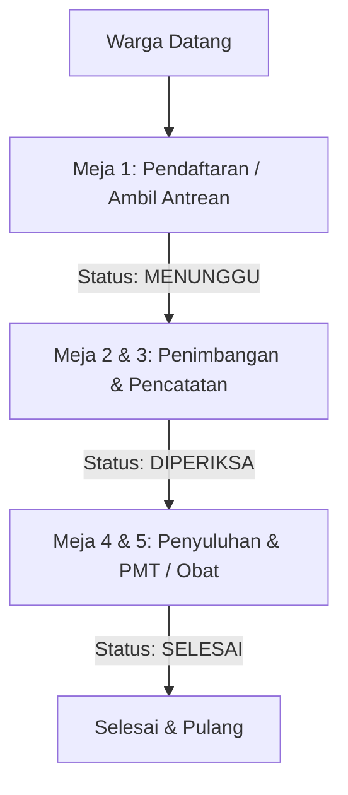

# 📋 Rencana Penyelesaian Sistem Posyandu (Roadmap Menuju 100% Selesai)

Roadmap ini merangkum langkah-langkah konkret yang perlu diimplementasikan untuk menyelesaikan fitur-fitur yang tersisa, khususnya **Modul Riwayat** dan **Pencatatan Sesi**.

---

## 🛠️ 1. Modul Riwayat & Ekspor Laporan

Modul Riwayat telah terintegrasi untuk query data riwayat dan ekspor CSV. Namun beberapa fitur penunjang ekspor dan analisis tingkat lanjut belum sepenuhnya selesai.

### Status Implementasi:
- [x] **Backend API Riwayat Perkembangan**:
  - Endpoint `GET /api/posyandu/:posyanduId/riwayat` yang menerima filter `tipe` (Balita/Lansia), `search`, dan rentang `bulan/tahun`.
- [x] **Visualisasi Grafik Pertumbuhan (Frontend)**:
  - Tampilan grafik tren perkembangan balita & lansia.
- [x] **Ekspor Format CSV**:
  - Endpoint `/api/posyandu/:posyanduId/riwayat/export` untuk men-generate file data riwayat.
- [ ] **Ekspor Format PDF & Excel (.xlsx) Siap Cetak**:
  - Men-generate file **PDF** terformat rapi sesuai template Laporan Posyandu Kemenkes/Puskesmas.
  - Men-generate spreadsheet **Excel (.xlsx)** dengan format tabel register fisik yang sesuai standar Puskesmas.

---

## 📝 2. Sinkronisasi Field Baru dari Document Improvement & Register Fisik

Sesuai pembaruan pada `project-brief-posyandu.md` dan `srs-posyandu.md`, skema database Prisma dan Form Input Frontend perlu disesuaikan untuk menampung field tambahan dari register fisik:

### Task Backend (Prisma Schema & Service):
- [ ] Update `schema.prisma`:
  - `Balita`: Tambah `noUrut`.
  - `PemeriksaanBalita`: Tambah `lingkarLenganAtas`, `indikatorKms`, `asiEksklusif`, `obatCacing`, `statusImunisasi`.
  - `Lansia`: Tambah `noUrut`, `kelompokUmur`.
  - `PemeriksaanLansia`: Tambah `imt`, `kolesterol`, `asamUrat`, `kemandirianBulanan`, `mentalEmosionalBulanan`, `keluhan`, `pemberianObat`, `rujukan`.
- [ ] Update Zod Validator & Controller (`balita`, `lansia`, `riwayat`).

### Task Frontend (React/UI):
- [ ] Form Tambah/Edit Balita & Form Pemeriksaan Balita: Input field `noUrut`, `LiLA`, `ASI Eksklusif`, `Obat Cacing`, `Status Imunisasi`, dan Pilihan `KMS`.
- [ ] Form Tambah/Edit Lansia & Form Pemeriksaan Lansia: Input field `noUrut`, `IMT` (auto-calculate), `Kolesterol`, `Asam Urat`, `Kemandirian Bulanan`, `Keluhan`, `Pemberian Obat`, dan Toggle `Rujukan`.

---

## 🕒 3. Modul Pencatatan Sesi Hari Ini

Sesi Posyandu berjalan sebulan sekali. Kader memerlukan kontrol untuk membuka sesi posyandu hari ini, merekam siapa saja yang hadir, dan melihat performa sesi.

### Tugas yang Harus Dilakukan:
- [ ] **Skema Database Sesi (`SesiPosyandu`)**:
  - Menambahkan tabel `SesiPosyandu` di database untuk merekam sesi aktif posyandu.
  ```prisma
  model SesiPosyandu {
    id          String   @id @default(uuid())
    posyanduId  String   @map("posyandu_id")
    tanggal     DateTime @default(now())
    status      String   @default("AKTIF") // AKTIF, SELESAI
    catatan     String?
    posyandu    Posyandu @relation(fields: [posyanduId], references: [id])
    
    @@map("sesi_posyandu")
  }
  ```
- [ ] **Backend Service Kontrol Sesi**:
  - Membuat API untuk membuka sesi (`POST /api/posyandu/:posyanduId/sesi/mulai`) dan menutup sesi (`POST /api/posyandu/:posyanduId/sesi/selesai`).
  - Menolak input pemeriksaan bulanan jika tidak ada sesi posyandu yang sedang aktif hari ini.
- [ ] **Rangkuman Sesi di UI**:
  - Menampilkan statistik sesi berjalan di modul Pelayanan (misal: Total hadir dan grafik status gizi hari ini).

---
## 🚫 Out of Scope (Di Luar Cakupan)

Fitur-fitur berikut telah diputuskan untuk berada di luar cakupan (out of scope) pengerjaan pada fase ini:

### 🚶‍♂️ Sistem Antrean & Kunjungan Hari Ini
Sistem antrean alur pelayanan di lapangan (Meja 1-5) ditangguhkan dan tidak menjadi prioritas utama.

#### Arsitektur Alur Antrean Posyandu (Rencana Awal)


#### Rencana Tugas (Ditangguhkan):
- **Skema Database Antrean (`Antrean`)**:
  - Membuat tabel `Antrean` untuk melacak status kunjungan warga secara real-time pada hari H posyandu.
  ```prisma
  model Antrean {
    id          String   @id @default(uuid())
    posyanduId  String   @map("posyandu_id")
    nomor       Int      // Nomor urut antrean (cth: 1, 2, 3...)
    pasienId    String   @map("pasien_id") // Relasi ke ID Balita atau Lansia
    tipePasien  String   @map("tipe_pasien") // "BALITA" atau "LANSIA"
    status      String   @default("MENUNGGU") // MENUNGGU, DIPERIKSA, SELESAI, BATAL
    waktuMasuk  DateTime @default(now()) @map("waktu_masuk")
    waktuSelesai DateTime? @map("waktu_selesai")
    posyandu    Posyandu @relation(fields: [posyanduId], references: [id])
    
    @@map("antrean")
  }
  ```
- **Backend API Antrean**:
  - `POST /api/posyandu/:posyanduId/antrean`: Menambahkan warga ke dalam antrean hari ini (otomatis mendapat nomor urut berikutnya).
  - `GET /api/posyandu/:posyanduId/antrean/aktif`: Mengambil daftar antrean hari ini yang berstatus `MENUNGGU` dan `DIPERIKSA`.
  - `PATCH /api/posyandu/:posyanduId/antrean/:id`: Memperbarui status antrean (misal: memanggil antrean berikutnya atau menyelesaikan antrean).
- **Komponen UI Papan Panggilan Antrean**:
  - Membuat widget antrean di dashboard utama untuk menampilkan **Nomor Antrean Saat Ini** yang sedang dilayani di Meja Pelayanan.
  - Tombol **"Panggil Antrean Berikutnya"** bagi kader untuk memperbarui status antrean secara real-time.
- **Daftar Kunjungan Hari Ini (Dashboard)**:
  - Menyambungkan tabel "Kunjungan Hari Ini" di dashboard utama langsung ke endpoint `GET /api/posyandu/:posyanduId/antrean/history` untuk menampilkan warga yang telah selesai diperiksa hari ini.
