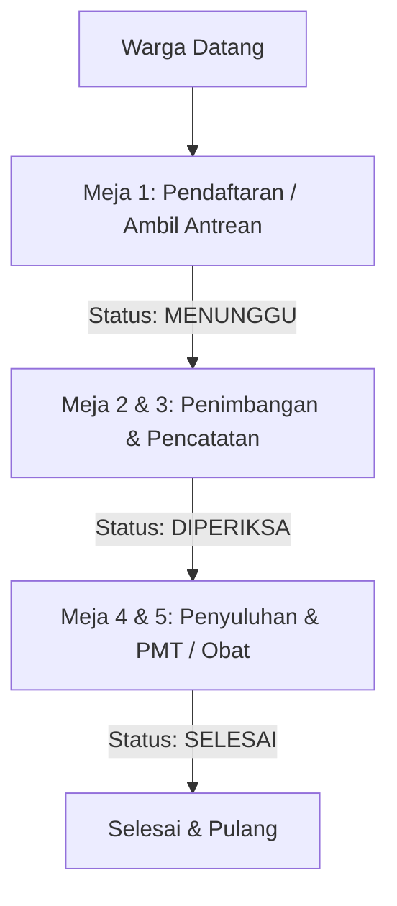

# 📋 Rencana Penyelesaian Sistem Posyandu (Roadmap Menuju 100% Selesai)

Roadmap ini merangkum langkah-langkah konkret yang perlu diimplementasikan untuk menyelesaikan fitur-fitur yang tersisa, khususnya **Modul Riwayat** dan **Pencatatan Sesi**.

---

## 🛠️ 1. Modul Riwayat Perkembangan Bulanan

Modul Riwayat saat ini belum terintegrasi sepenuhnya dengan backend dan database. Kader membutuhkan data komprehensif untuk melihat riwayat pertumbuhan dari waktu ke waktu secara perorangan maupun kolektif.

### Tugas yang Harus Dilakukan:
- [x] **Backend API Riwayat Perkembangan**:
  - Membuat endpoint `GET /api/posyandu/:posyanduId/riwayat` yang menerima filter `tipe` (Balita/Lansia), `search`, dan rentang `bulan/tahun`.
  - Mengembalikan data agrerat perkembangan bulanan untuk keperluan statistik kader posyandu.
- [x] **Visualisasi Grafik Pertumbuhan (Frontend)**:
  - Mengintegrasikan library charting (seperti Chart.js atau Recharts) pada modul Riwayat.
  - Menampilkan grafik perkembangan individual (misal: kurva tinggi & berat badan balita dibandingkan dengan garis median standar WHO).
- [x] **Fitur Ekspor Laporan**:
  - Menyediakan endpoint backend `/api/posyandu/:posyanduId/export` untuk men-generate file **Excel (.xlsx)** atau **PDF**.
  - Laporan harus siap cetak untuk diserahkan ke Puskesmas kecamatan sesuai template standar Kemenkes.

---

## 🕒 2. Modul Pencatatan Sesi Hari Ini

Sesi Posyandu berjalan sebulan sekali. Kader memerlukan kontrol untuk membuka sesi posyandu hari ini, merekam siapa saja yang hadir, dan melihat performa sesi (misal: "80% balita terdaftar telah hadir hari ini").

### Tugas yang Harus Dilakukan:
- [ ] **Skema Database Sesi (`SesiPosyandu`)**:
  - Menambahkan tabel `SesiPosyandu` di database untuk merekam sesi aktif posyandu.
  ```prisma
  model SesiPosyandu {
    id          String   @id @default(uuid())
    posyanduId  String   @map("posyandu_id")
    tanggal     DateTime @default(now())
    status      String   @default("AKTIF") // AKTIF, SELESAI
    catatan     String?
    posyandu    Posyandu @relation(fields: [posyanduId], references: [id])
    
    @@map("sesi_posyandu")
  }
  ```
- [ ] **Backend Service Kontrol Sesi**:
  - Membuat API untuk membuka sesi (`POST /api/posyandu/:posyanduId/sesi/mulai`) dan menutup sesi (`POST /api/posyandu/:posyanduId/sesi/selesai`).
  - Menolak input pemeriksaan bulanan jika tidak ada sesi posyandu yang sedang aktif hari ini (mencegah salah input di luar hari posyandu).
- [ ] **Rangkuman Sesi di UI**:
  - Menampilkan statistik sesi berjalan di modul Pelayanan (misal: Total hadir, rata-rata waktu tunggu warga, dan grafik status gizi hari ini).

---
## 🚫 Out of Scope (Di Luar Cakupan)

Fitur-fitur berikut telah diputuskan untuk berada di luar cakupan (out of scope) pengerjaan pada fase ini:

### 🚶‍♂️ Sistem Antrean & Kunjungan Hari Ini
Sistem antrean alur pelayanan di lapangan (Meja 1-5) ditangguhkan dan tidak menjadi prioritas utama.

#### Arsitektur Alur Antrean Posyandu (Rencana Awal)


#### Rencana Tugas (Ditangguhkan):
- **Skema Database Antrean (`Antrean`)**:
  - Membuat tabel `Antrean` untuk melacak status kunjungan warga secara real-time pada hari H posyandu.
  ```prisma
  model Antrean {
    id          String   @id @default(uuid())
    posyanduId  String   @map("posyandu_id")
    nomor       Int      // Nomor urut antrean (cth: 1, 2, 3...)
    pasienId    String   @map("pasien_id") // Relasi ke ID Balita atau Lansia
    tipePasien  String   @map("tipe_pasien") // "BALITA" atau "LANSIA"
    status      String   @default("MENUNGGU") // MENUNGGU, DIPERIKSA, SELESAI, BATAL
    waktuMasuk  DateTime @default(now()) @map("waktu_masuk")
    waktuSelesai DateTime? @map("waktu_selesai")
    posyandu    Posyandu @relation(fields: [posyanduId], references: [id])
    
    @@map("antrean")
  }
  ```
- **Backend API Antrean**:
  - `POST /api/posyandu/:posyanduId/antrean`: Menambahkan warga ke dalam antrean hari ini (otomatis mendapat nomor urut berikutnya).
  - `GET /api/posyandu/:posyanduId/antrean/aktif`: Mengambil daftar antrean hari ini yang berstatus `MENUNGGU` dan `DIPERIKSA`.
  - `PATCH /api/posyandu/:posyanduId/antrean/:id`: Memperbarui status antrean (misal: memanggil antrean berikutnya atau menyelesaikan antrean).
- **Komponen UI Papan Panggilan Antrean**:
  - Membuat widget antrean di dashboard utama untuk menampilkan **Nomor Antrean Saat Ini** yang sedang dilayani di Meja Pelayanan.
  - Tombol **"Panggil Antrean Berikutnya"** bagi kader untuk memperbarui status antrean secara real-time.
- **Daftar Kunjungan Hari Ini (Dashboard)**:
  - Menyambungkan tabel "Kunjungan Hari Ini" di dashboard utama langsung ke endpoint `GET /api/posyandu/:posyanduId/antrean/history` untuk menampilkan warga yang telah selesai diperiksa hari ini.
